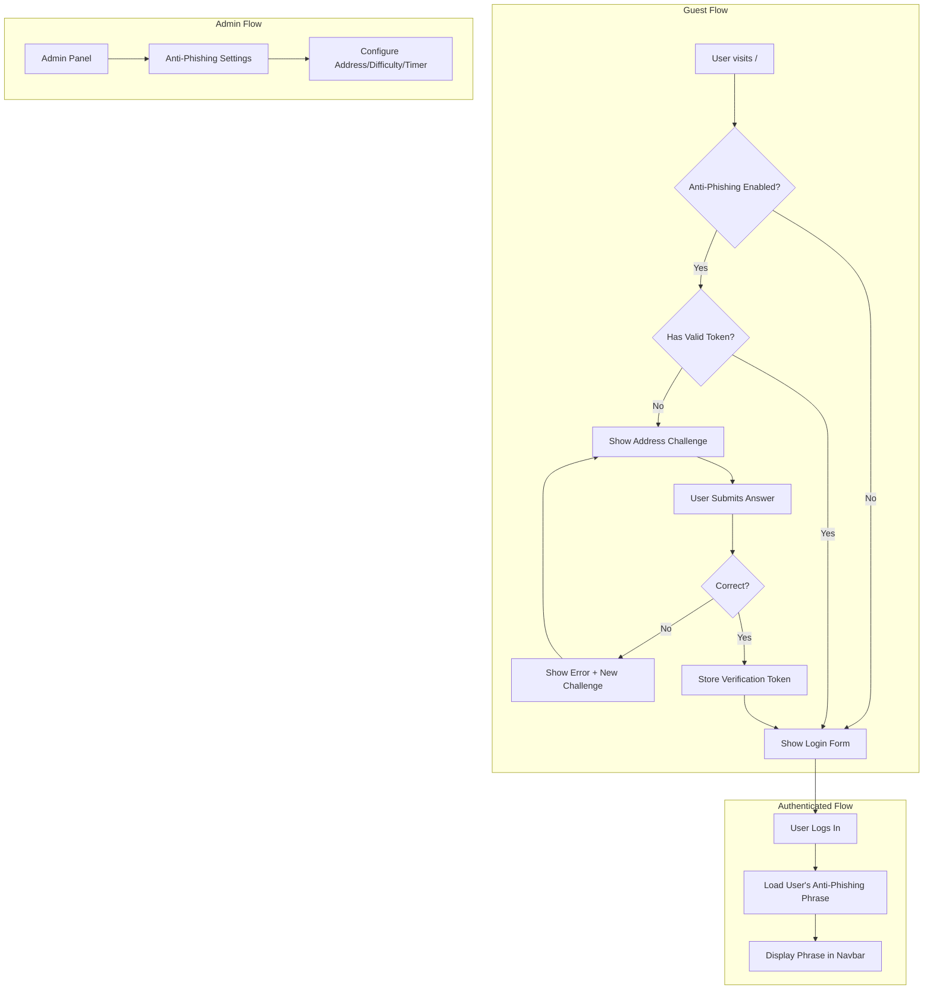

# Design Document: Anti-Phishing Protection System

## Overview

This design document describes the implementation of a multi-layered anti-phishing protection system for Hecate Market. The system provides two primary protection mechanisms:

1. **Address Verification Challenge**: Before accessing the login form, users must prove they know the official .onion address by typing masked characters
2. **Personal Anti-Phishing Phrase**: Users can set a secret phrase displayed on every authenticated page, allowing them to verify site authenticity

The system integrates with the existing Laravel 11 authentication flow, uses server-side session management (no JavaScript), and provides admin configuration through the existing admin panel.

## Architecture



## Components and Interfaces

### 1. AntiPhishingService

A service class responsible for challenge generation, validation, and configuration management.

```php
<?php

namespace App\Services;

class AntiPhishingService
{
    /**
     * Generate a new address challenge
     * @return array{masked_address: string, positions: array<int>, expected: array<string>, expires_at: \Carbon\Carbon}
     */
    public function generateChallenge(): array;
    
    /**
     * Validate user's answer against the challenge
     * @param array<string> $userAnswer
     * @param array<int> $positions
     * @param array<string> $expected
     * @return bool
     */
    public function validateChallenge(array $userAnswer, array $positions, array $expected): bool;
    
    /**
     * Check if anti-phishing is enabled
     * @return bool
     */
    public function isEnabled(): bool;
    
    /**
     * Get the official onion address
     * @return string
     */
    public function getOnionAddress(): string;
    
    /**
     * Get challenge difficulty (number of masked characters)
     * @return int
     */
    public function getDifficulty(): int;
    
    /**
     * Get challenge time limit in minutes
     * @return int
     */
    public function getTimeLimit(): int;
    
    /**
     * Check if user has exceeded rate limit
     * @param string $sessionId
     * @return bool
     */
    public function isRateLimited(string $sessionId): bool;
    
    /**
     * Record a challenge attempt
     * @param string $sessionId
     * @return void
     */
    public function recordAttempt(string $sessionId): void;
}
```

### 2. AntiPhishingController

Handles the address verification challenge flow.

```php
<?php

namespace App\Http\Controllers;

class AntiPhishingController extends Controller
{
    /**
     * Show the address verification challenge page
     * GET /anti-phishing/challenge
     */
    public function showChallenge(): \Illuminate\View\View|\Illuminate\Http\RedirectResponse;
    
    /**
     * Verify the user's challenge answer
     * POST /anti-phishing/verify
     */
    public function verifyChallenge(Request $request): \Illuminate\Http\RedirectResponse;
}
```

### 3. AntiPhishingMiddleware

Middleware to enforce address verification before login.

```php
<?php

namespace App\Http\Middleware;

class AntiPhishingMiddleware
{
    /**
     * Handle an incoming request
     * Redirects to challenge if anti-phishing is enabled and no valid token exists
     */
    public function handle(Request $request, Closure $next): mixed;
}
```

### 4. AdminController Extensions

Add methods to the existing AdminController for anti-phishing configuration.

```php
// Additional methods in AdminController
public function showAntiPhishingSettings(): \Illuminate\View\View;
public function updateAntiPhishingSettings(Request $request): \Illuminate\Http\RedirectResponse;
```

### 5. SettingsController Extensions

Extend the existing SettingsController to allow phrase updates (not just one-time setting).

```php
// Modified method in SettingsController
public function updateSecretPhrase(Request $request): \Illuminate\Http\RedirectResponse;
```

### 6. View Components

#### Anti-Phishing Phrase Display Component
```php
// resources/views/components/anti-phishing-badge.blade.php
// Displays the user's anti-phishing phrase in the navbar
```

#### Address Challenge View
```php
// resources/views/auth/anti-phishing-challenge.blade.php
// Shows the masked address and input fields for missing characters
```

## Data Models

### Configuration Storage

Anti-phishing settings will be stored in `config/antiphishing.php` with environment variable overrides:

```php
<?php
// config/antiphishing.php

return [
    /*
    |--------------------------------------------------------------------------
    | Anti-Phishing Feature Toggle
    |--------------------------------------------------------------------------
    */
    'enabled' => env('ANTIPHISHING_ENABLED', true),

    /*
    |--------------------------------------------------------------------------
    | Official Onion Address
    |--------------------------------------------------------------------------
    | The official .onion address of the marketplace (without http://)
    */
    'onion_address' => env('ANTIPHISHING_ONION_ADDRESS', ''),

    /*
    |--------------------------------------------------------------------------
    | Challenge Difficulty
    |--------------------------------------------------------------------------
    | Number of characters to mask (2-8)
    */
    'difficulty' => env('ANTIPHISHING_DIFFICULTY', 4),

    /*
    |--------------------------------------------------------------------------
    | Challenge Time Limit
    |--------------------------------------------------------------------------
    | Time limit for completing the challenge in minutes (1-10)
    */
    'time_limit' => env('ANTIPHISHING_TIME_LIMIT', 5),

    /*
    |--------------------------------------------------------------------------
    | Rate Limiting
    |--------------------------------------------------------------------------
    */
    'max_attempts' => env('ANTIPHISHING_MAX_ATTEMPTS', 5),
    'lockout_minutes' => env('ANTIPHISHING_LOCKOUT_MINUTES', 10),
];
```

### Database Schema

#### Migration: Modify secret_phrases table

```php
// Extend phrase column from 16 to 32 characters
Schema::table('secret_phrases', function (Blueprint $table) {
    $table->string('phrase', 32)->change();
});
```

#### Migration: Create anti_phishing_settings table (for admin-configurable settings)

```php
Schema::create('anti_phishing_settings', function (Blueprint $table) {
    $table->id();
    $table->string('key')->unique();
    $table->text('value');
    $table->timestamps();
});
```

### Session Data Structure

Challenge data stored in Laravel session:

```php
// Session keys
'anti_phishing_challenge' => [
    'positions' => [3, 7, 12, 15],      // Masked character positions
    'expected' => ['a', 'b', 'c', 'd'], // Expected characters
    'expires_at' => '2025-01-15 10:05:00',
    'created_at' => '2025-01-15 10:00:00',
]

'anti_phishing_verified' => true  // Set after successful challenge
'anti_phishing_verified_at' => '2025-01-15 10:01:00'

'anti_phishing_attempts' => [
    'count' => 3,
    'first_attempt_at' => '2025-01-15 10:00:00',
]
```

## Correctness Properties

*A property is a characteristic or behavior that should hold true across all valid executions of a system—essentially, a formal statement about what the system should do. Properties serve as the bridge between human-readable specifications and machine-verifiable correctness guarantees.*


### Property 1: Challenge Difficulty Consistency
*For any* configured difficulty level N (where 2 ≤ N ≤ 8), when generating a challenge, the resulting masked address SHALL contain exactly N asterisk positions, and the positions array SHALL have exactly N elements.
**Validates: Requirements 1.2**

### Property 2: Case-Insensitive Challenge Validation
*For any* challenge with expected characters and *for any* user input that matches those characters regardless of case (uppercase/lowercase), the validation SHALL return true. Conversely, for any input that does not match, validation SHALL return false.
**Validates: Requirements 1.3**

### Property 3: Failed Validation Regenerates Challenge
*For any* challenge verification attempt with incorrect input, the system SHALL generate a new challenge with different masked positions than the previous challenge (with high probability given random selection).
**Validates: Requirements 1.4**

### Property 4: Challenge Time-Based Expiration
*For any* challenge created with a time limit T, if the current time exceeds the challenge's creation time plus T minutes, the challenge SHALL be considered expired and validation SHALL fail regardless of input correctness.
**Validates: Requirements 1.5, 1.6, 3.3**

### Property 5: Successful Challenge Stores Verification Token
*For any* successful challenge completion (correct input within time limit), the session SHALL contain a verification token that allows access to the login form.
**Validates: Requirements 1.7**

### Property 6: Anti-Phishing Phrase Display for Authenticated Users
*For any* authenticated user with a set anti-phishing phrase, every authenticated page response SHALL contain the user's phrase in the HTML output.
**Validates: Requirements 2.1**

### Property 7: Phrase Validation Rules
*For any* string input for anti-phishing phrase, the validation SHALL accept only strings containing exclusively alphabetic characters (a-z, A-Z) with length between 4 and 32 characters inclusive. All other inputs SHALL be rejected.
**Validates: Requirements 2.3**

### Property 8: Phrase Storage Round-Trip
*For any* valid anti-phishing phrase set by a user, retrieving the phrase from the database for that user SHALL return the exact same phrase that was stored.
**Validates: Requirements 2.5**

### Property 9: Onion Address Format Validation
*For any* string submitted as an onion address, the validation SHALL accept only strings matching the v3 onion format: exactly 56 alphanumeric characters followed by ".onion". All other formats SHALL be rejected.
**Validates: Requirements 4.3**

### Property 10: Admin Configuration Range Validation
*For any* difficulty value, the system SHALL accept only integers in range [2, 8]. *For any* time limit value, the system SHALL accept only integers in range [1, 10]. Values outside these ranges SHALL be rejected.
**Validates: Requirements 4.5, 4.6**

### Property 11: Settings Change Audit Logging
*For any* anti-phishing settings update by an admin, the system SHALL create a log entry containing the admin's user ID and a timestamp within 1 second of the update.
**Validates: Requirements 4.7**

### Property 12: Challenge Data Not Exposed to Client
*For any* generated challenge, the HTML response of the challenge page SHALL NOT contain the expected characters in plain text. Only the masked address (with asterisks) SHALL be visible.
**Validates: Requirements 5.1**

### Property 13: Verification Token Security
*For any* verification token generated after successful challenge completion, the token SHALL be at least 32 characters long and generated using a cryptographically secure random generator.
**Validates: Requirements 5.2**

### Property 14: Middleware Enforces Verification
*For any* request to the login page when anti-phishing is enabled, if the session does not contain a valid (non-expired) verification token, the request SHALL be redirected to the challenge page.
**Validates: Requirements 5.3, 5.4**

### Property 15: Rate Limiting Enforcement
*For any* session that has made 5 or more failed challenge attempts within a 10-minute window, subsequent challenge verification attempts SHALL be rejected until the lockout period expires.
**Validates: Requirements 5.6**

### Property 16: Extended Phrase Length Support
*For any* valid phrase string up to 32 characters, the database storage operation SHALL succeed without truncation, and retrieval SHALL return the complete phrase.
**Validates: Requirements 6.1**

### Property 17: Phrase Update Idempotence
*For any* user, regardless of how many times they update their anti-phishing phrase, there SHALL be exactly one phrase record in the database for that user (no duplicates created).
**Validates: Requirements 6.3**

## Error Handling

### Challenge Errors

| Error Condition | Response | User Message |
|----------------|----------|--------------|
| Incorrect characters entered | Redirect to new challenge | "Incorrect characters. Please try again with a new challenge." |
| Challenge expired | Redirect to new challenge | "Challenge expired. Please complete a new verification." |
| Rate limit exceeded | Show lockout page | "Too many attempts. Please wait X minutes before trying again." |
| Invalid session | Redirect to new challenge | "Session invalid. Please start a new verification." |

### Admin Configuration Errors

| Error Condition | Response | User Message |
|----------------|----------|--------------|
| Invalid onion address format | Validation error | "Invalid .onion address format. Must be 56 characters followed by .onion" |
| Difficulty out of range | Validation error | "Difficulty must be between 2 and 8 characters." |
| Time limit out of range | Validation error | "Time limit must be between 1 and 10 minutes." |

### Phrase Setting Errors

| Error Condition | Response | User Message |
|----------------|----------|--------------|
| Phrase too short | Validation error | "Phrase must be at least 4 characters." |
| Phrase too long | Validation error | "Phrase cannot exceed 32 characters." |
| Invalid characters | Validation error | "Phrase must contain only letters (no numbers or special characters)." |

## Testing Strategy

### Unit Tests

Unit tests will cover specific examples and edge cases:

1. **AntiPhishingService Tests**
   - Challenge generation with various difficulty levels
   - Validation with exact match, case variations, partial matches
   - Expiration checking at boundary times
   - Rate limiting counter increments and resets

2. **Validation Tests**
   - Onion address format edge cases (55 chars, 57 chars, invalid chars)
   - Phrase validation edge cases (3 chars, 33 chars, numbers, special chars)
   - Difficulty/time limit boundary values

3. **Middleware Tests**
   - Request handling with valid token
   - Request handling with expired token
   - Request handling with no token
   - Bypass when anti-phishing disabled

### Property-Based Tests

Property-based tests will use a PHP property testing library (e.g., `eris/eris` or `phpspec/prophecy` with generators) to verify universal properties:

1. **Challenge Generation Properties** (Property 1)
   - Generate challenges with random difficulty values
   - Verify masked position count matches difficulty

2. **Validation Properties** (Property 2)
   - Generate random expected characters and matching inputs with random case
   - Verify validation passes for all case combinations

3. **Phrase Validation Properties** (Property 7)
   - Generate random strings of various lengths and character sets
   - Verify acceptance/rejection matches rules

4. **Onion Address Validation Properties** (Property 9)
   - Generate random strings of various formats
   - Verify only valid v3 onion addresses pass

5. **Rate Limiting Properties** (Property 15)
   - Simulate sequences of failed attempts
   - Verify lockout triggers at correct threshold

### Test Configuration

- Property tests: Minimum 100 iterations per property
- Each property test tagged with: **Feature: anti-phishing, Property N: [property_text]**
- Use PHPUnit with `eris/eris` for property-based testing in PHP
