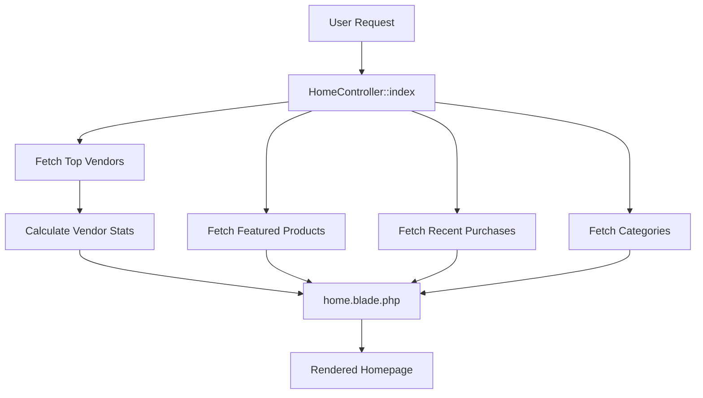
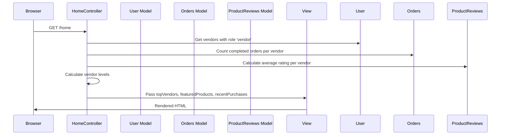

# Design Document: Homepage Redesign

## Overview

This design transforms the Hecate Market homepage from a static welcome page into a dynamic, product-focused landing page. The redesign introduces four main sections: Top Vendors, Search Bar, Featured Products, and Recent Purchases, while maintaining the existing sidebar navigation.

The implementation follows Laravel/Blade conventions, modifying the existing `HomeController` and `home.blade.php` view to incorporate the new sections. New helper methods will be added to calculate vendor statistics (level, deals, rating).

## Architecture

### High-Level Component Flow



### Data Flow



## Components and Interfaces

### HomeController Modifications

The `HomeController::index` method will be extended to fetch and prepare data for all homepage sections.

```php
class HomeController extends Controller
{
    public function index(XmrPriceController $xmrPriceController)
    {
        // Existing: popup, advertisements, featured products
        
        // New: Top vendors with stats
        $topVendors = $this->getTopVendors();
        
        // New: Recent purchases
        $recentPurchases = $this->getRecentPurchases();
        
        // Existing: categories (for search bar)
        $categories = Category::mainCategories();
        
        return view('home', [
            // ... existing data
            'topVendors' => $topVendors,
            'recentPurchases' => $recentPurchases,
            'categories' => $categories,
        ]);
    }
    
    private function getTopVendors(): Collection
    {
        // Fetch vendors, calculate stats, sort by level/deals
    }
    
    private function getRecentPurchases(): Collection
    {
        // Fetch last 8 completed orders
    }
    
    public static function calculateVendorLevel(int $completedDeals): int
    {
        // Calculate level based on deals count
    }
    
    public static function calculateVendorRating(string $vendorId): ?float
    {
        // Calculate average rating from all product reviews
    }
}
```

### Vendor Statistics Helper Methods

#### calculateVendorLevel

```php
/**
 * Calculate vendor level based on completed deals.
 * 
 * Level thresholds:
 * - Level 1: 0-9 deals
 * - Level 2: 10-24 deals
 * - Level 3: 25-49 deals
 * - Level 4: 50-99 deals
 * - Level 5: 100-199 deals
 * - Level 6+: Each additional 100 deals up to level 20
 * 
 * @param int $completedDeals Number of completed orders
 * @return int Vendor level (1-20)
 */
public static function calculateVendorLevel(int $completedDeals): int
{
    if ($completedDeals < 10) return 1;
    if ($completedDeals < 25) return 2;
    if ($completedDeals < 50) return 3;
    if ($completedDeals < 100) return 4;
    if ($completedDeals < 200) return 5;
    
    // Level 6+: each 100 deals adds 1 level, max 20
    $additionalLevels = floor(($completedDeals - 200) / 100);
    return min(20, 5 + $additionalLevels + 1);
}
```

#### calculateVendorRating

```php
/**
 * Calculate vendor rating from all product reviews.
 * 
 * @param string $vendorId UUID of the vendor
 * @return float|null Average rating (0-5) or null if no reviews
 */
public static function calculateVendorRating(string $vendorId): ?float
{
    $productIds = Product::where('user_id', $vendorId)->pluck('id');
    
    if ($productIds->isEmpty()) {
        return null;
    }
    
    $avgRating = ProductReviews::whereIn('product_id', $productIds)
        ->avg('rating');
    
    return $avgRating ? round($avgRating, 2) : null;
}
```

### View Components

#### Top Vendors Section

```blade
<div class="home-top-vendors">
    <h2 class="home-section-title">🔥 Top Vendors 🔥</h2>
    <div class="home-vendors-grid">
        @foreach($topVendors as $vendor)
            <a href="{{ route('vendors.show', $vendor->username) }}" class="home-vendor-card">
                <div class="home-vendor-avatar">
                    profile?->profile_picture_url ?? asset('images/default-profile-picture.png') }}" 
                         alt="{{ $vendor->username }}">
                </div>
                <div class="home-vendor-info">
                    <span class="home-vendor-username">{{ $vendor->username }}</span>
                    <span class="home-vendor-level">Level {{ $vendor->level }}</span>
                    <span class="home-vendor-deals">DEALS {{ $vendor->deals_count }}</span>
                    <span class="home-vendor-rating">
                        RATING {{ $vendor->rating ? number_format($vendor->rating, 2) . '★' : '—' }}
                    </span>
                </div>
            </a>
        @endforeach
    </div>
    <a href="{{ route('vendors.index') }}" class="home-all-vendors-link">▼ All Vendors ▼</a>
</div>
```

#### Search Bar Section

```blade
<div class="home-search-section">
    <form action="{{ route('products.index') }}" method="GET" class="home-search-form">
        <div class="home-search-filters">
            <input type="text" name="vendor" placeholder="Search vendor 🔎" class="home-search-input">
            <select name="type" class="home-search-select">
                <option value="">All Types</option>
                <option value="digital">Digital</option>
                <option value="cargo">Cargo</option>
                <option value="deaddrop">Dead Drop</option>
            </select>
            <select name="category" class="home-search-select">
                <option value="">All Categories</option>
                @foreach($categories as $category)
                    <option value="{{ $category->id }}">{{ $category->name }}</option>
                @endforeach
            </select>
            <select name="sort_price" class="home-search-select">
                <option value="">Most Recent</option>
                <option value="asc">Price: Low to High</option>
                <option value="desc">Price: High to Low</option>
            </select>
        </div>
        <div class="home-search-main">
            <input type="text" name="search" placeholder="Search by product title 🔎" class="home-search-main-input">
        </div>
        <div class="home-search-actions">
            <a href="{{ route('home') }}" class="home-search-reset">Reset Filters</a>
            <button type="submit" class="home-search-submit">Apply Filters</button>
        </div>
    </form>
</div>
```

#### Recent Purchases Section

```blade
@if($recentPurchases->isNotEmpty())
<div class="home-recent-purchases">
    <h2 class="home-section-title">Recent Purchases</h2>
    <div class="home-purchases-grid">
        @foreach($recentPurchases as $purchase)
            <div class="home-purchase-item">
                <span class="home-purchase-product">{{ $purchase->product_name }}</span>
                <span class="home-purchase-price">${{ number_format($purchase->price, 2) }}</span>
            </div>
        @endforeach
    </div>
</div>
@endif
```

## Data Models

### Vendor Statistics Data Structure

```php
// Data passed to view for each top vendor
[
    'id' => 'uuid',
    'username' => 'string',
    'profile' => Profile|null,  // For profile picture
    'level' => int,             // Calculated: 1-20
    'deals_count' => int,       // Count of completed orders
    'rating' => float|null,     // Average rating or null
]
```

### Recent Purchase Data Structure

```php
// Data passed to view for each recent purchase
[
    'product_name' => 'string',
    'price' => float,
    'completed_at' => Carbon,
]
```

### Database Queries

#### Top Vendors Query

```php
// Get vendors with completed order counts
$vendors = User::whereHas('roles', fn($q) => $q->where('name', 'vendor'))
    ->whereDoesntHave('vendorProfile', fn($q) => $q->where('vacation_mode', true))
    ->with('profile')
    ->withCount(['vendorOrders as deals_count' => fn($q) => 
        $q->where('status', Orders::STATUS_COMPLETED)
    ])
    ->get();

// Sort by level (calculated), then deals_count
$vendors = $vendors->map(function ($vendor) {
    $vendor->level = HomeController::calculateVendorLevel($vendor->deals_count);
    $vendor->rating = HomeController::calculateVendorRating($vendor->id);
    return $vendor;
})->sortByDesc('level')->sortByDesc('deals_count')->take(5);
```

#### Recent Purchases Query

```php
$recentPurchases = Orders::where('status', Orders::STATUS_COMPLETED)
    ->with('items')
    ->orderBy('completed_at', 'desc')
    ->take(8)
    ->get()
    ->flatMap(fn($order) => $order->items->map(fn($item) => [
        'product_name' => $item->product_name,
        'price' => $item->price,
    ]));
```


## Correctness Properties

*A property is a characteristic or behavior that should hold true across all valid executions of a system—essentially, a formal statement about what the system should do. Properties serve as the bridge between human-readable specifications and machine-verifiable correctness guarantees.*

### Property 1: Vendor Level Calculation Correctness

*For any* non-negative integer representing completed deals, the `calculateVendorLevel` function SHALL return the correct level according to the defined thresholds:
- 0-9 deals → Level 1
- 10-24 deals → Level 2
- 25-49 deals → Level 3
- 50-99 deals → Level 4
- 100-199 deals → Level 5
- 200+ deals → Level 6-20 (each additional 100 deals adds 1 level, capped at 20)

**Validates: Requirements 6.1, 6.2, 6.3, 6.4, 6.5, 6.6, 6.7**

### Property 2: Vendor Rating Calculation Correctness

*For any* vendor with one or more product reviews, the `calculateVendorRating` function SHALL return the arithmetic mean of all review ratings, rounded to 2 decimal places. *For any* vendor with zero reviews, the function SHALL return null.

**Validates: Requirements 7.1, 7.2, 7.4**

### Property 3: Top Vendors Sorting Correctness

*For any* collection of vendors returned by `getTopVendors`, the vendors SHALL be sorted in descending order by level first, then by deals count descending for vendors with equal levels.

**Validates: Requirements 1.3**

### Property 4: Top Vendors Maximum Count

*For any* number of vendors in the system, the `getTopVendors` function SHALL return at most 5 vendors.

**Validates: Requirements 1.2**

### Property 5: Recent Purchases Sorting Correctness

*For any* collection of purchases returned by `getRecentPurchases`, the purchases SHALL be sorted in descending order by completion date (most recent first).

**Validates: Requirements 4.3**

### Property 6: Recent Purchases Maximum Count

*For any* number of completed orders in the system, the `getRecentPurchases` function SHALL return at most 8 purchases.

**Validates: Requirements 4.2**

### Property 7: Vacation Mode Vendor Filtering

*For any* vendor in vacation mode, that vendor SHALL NOT appear in the top vendors list, AND products from that vendor SHALL NOT appear in the featured products section.

**Validates: Requirements 1.8, 3.8**

### Property 8: Soft-Deleted Product Filtering

*For any* soft-deleted product, that product SHALL NOT appear in the featured products section.

**Validates: Requirements 3.7**

### Property 9: Completed Orders Only Filtering

*For any* order that does not have status "completed", that order SHALL NOT appear in the recent purchases section.

**Validates: Requirements 4.6**

### Property 10: Categories Dropdown Completeness

*For any* set of main categories in the database, all categories SHALL appear as options in the search bar category dropdown.

**Validates: Requirements 2.4**

## Error Handling

### Database Query Failures

- If vendor query fails, log error and return empty collection for top vendors
- If orders query fails, log error and return empty collection for recent purchases
- If category query fails, log error and return empty collection for categories

### Missing Data Handling

- If vendor has no profile, use default profile picture
- If vendor has no reviews, display "—" for rating
- If product has no image, use default product image
- If XMR price unavailable, hide XMR price display

### Edge Cases

- Zero vendors in system: Top vendors section displays empty state
- Zero featured products: Featured products section is hidden
- Zero completed orders: Recent purchases section is hidden
- Vendor with exactly 0 deals: Level 1, rating "—"

## Testing Strategy

### Property-Based Testing

Property-based tests will be implemented using **PHPUnit with custom data providers** to generate random test inputs. Each property test will run a minimum of 100 iterations.

#### Test Configuration

```php
// tests/Unit/HomeControllerTest.php
class HomeControllerTest extends TestCase
{
    /**
     * @dataProvider vendorLevelDataProvider
     * @test
     */
    public function vendor_level_calculation_is_correct(int $deals, int $expectedLevel): void
    {
        // Feature: homepage-redesign, Property 1: Vendor Level Calculation Correctness
        $this->assertEquals($expectedLevel, HomeController::calculateVendorLevel($deals));
    }
    
    public static function vendorLevelDataProvider(): array
    {
        $cases = [];
        // Generate 100+ test cases covering all level ranges
        for ($i = 0; $i < 100; $i++) {
            $deals = rand(0, 2500);
            $expectedLevel = self::expectedLevelForDeals($deals);
            $cases["deals_{$deals}"] = [$deals, $expectedLevel];
        }
        return $cases;
    }
}
```

### Unit Tests

Unit tests will cover:
- Specific examples for level calculation boundaries (0, 9, 10, 24, 25, etc.)
- Rating calculation with known review sets
- Empty state handling (no vendors, no products, no orders)
- Vacation mode filtering
- Soft-delete filtering

### Test File Structure

```
tests/
├── Unit/
│   ├── HomeControllerTest.php          # Property tests for calculations
│   └── VendorStatisticsTest.php        # Unit tests for edge cases
└── Feature/
    └── HomepageTest.php                # Integration tests for full page render
```

### Test Coverage Requirements

- All 10 correctness properties must have corresponding property-based tests
- Edge cases (boundaries, empty states) covered by unit tests
- Full page render tested with feature tests

## Visual Styling Specifications

### Color Palette (Matching Product Page)

```css
/* Background Colors */
--bg-primary: #121212;      /* Page background */
--bg-secondary: #1e1e1e;    /* Card backgrounds */
--bg-tertiary: #292929;     /* Inner card elements */

/* Border Colors */
--border-primary: #3c3c3c;  /* Default borders */
--border-accent: #534d4d;   /* Accent borders, hover states */

/* Text Colors */
--text-primary: #e0e0e0;    /* Main text */
--text-secondary: #a0a0a0;  /* Secondary text */
--text-accent: #534d4d;     /* Accent text, headings */

/* Badge Colors */
--badge-digital: #004D40;   /* Digital product type */
--badge-cargo: #CD853F;     /* Cargo product type */
--badge-deaddrop: #3D0814;  /* Dead drop product type */
--badge-category: #1976D2;  /* Category badge */

/* Price Colors */
--price-usd: #534d4d;       /* USD price */
--price-xmr: #a0a0a0;       /* XMR price */
--price-success: #4caf50;   /* Recent purchase price */
```

### Product Card Styling (Featured Products)

```css
.home-highlight-card {
    display: flex;
    flex-direction: row;
    gap: 20px;
    background-color: #292929;
    border: 1px solid #3c3c3c;
    border-radius: 8px;
    padding: 15px;
    transition: all 0.3s ease;
    overflow: hidden;  /* Prevent content overflow */
}

.home-highlight-card:hover {
    border-color: #534d4d;
    transform: translateY(-3px);
    box-shadow: 0 4px 12px rgba(0, 0, 0, 0.3);
}

.home-highlight-image {
    width: 120px;
    height: 120px;
    flex-shrink: 0;
    border-radius: 6px;
    overflow: hidden;
}

.home-highlight-image img {
    width: 100%;
    height: 100%;
    object-fit: cover;
}

.home-highlight-content {
    flex: 1;
    min-width: 0;  /* Allow text truncation */
    display: flex;
    flex-direction: column;
    justify-content: space-between;
}

.home-highlight-title {
    color: #e0e0e0;
    font-size: 16px;
    font-weight: 700;
    margin: 0 0 8px 0;
    white-space: nowrap;
    overflow: hidden;
    text-overflow: ellipsis;
}
```

### Grid Layout Specifications

```css
/* Featured Products Grid - 3 columns on desktop */
.home-highlight-container {
    display: grid;
    grid-template-columns: repeat(3, 1fr);
    gap: 20px;
}

/* Responsive breakpoints */
@media (max-width: 1100px) {
    .home-highlight-container {
        grid-template-columns: repeat(2, 1fr);
    }
}

@media (max-width: 768px) {
    .home-highlight-container {
        grid-template-columns: 1fr;
    }
}
```

### Overflow Prevention Rules

1. All containers must have `overflow: hidden` or proper `min-width: 0` for flex children
2. Long text must use `text-overflow: ellipsis` with `white-space: nowrap`
3. Images must use `object-fit: cover` to maintain aspect ratios
4. Grid layouts must use `minmax()` for flexible column sizing
5. Flex containers must use `flex-shrink: 0` for fixed-width elements
