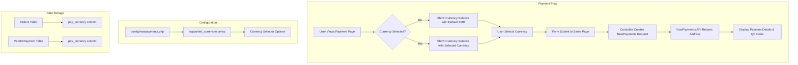

# Design Document: Multi-Currency Payments

## Overview

This feature extends the existing NowPayments.io integration to support multiple cryptocurrencies for payments. The current implementation only accepts Monero (XMR), but NowPayments supports many cryptocurrencies. This enhancement adds a currency selector to payment pages, allowing buyers to choose their preferred cryptocurrency when paying for orders, vendor registration fees, and advertisements.

The implementation follows a server-side approach consistent with the existing architecture (no JavaScript), using form submissions to change the selected currency and regenerate payment addresses.

## Architecture



## Components and Interfaces

### 1. Configuration Extension (config/nowpayments.php)

Add a new configuration array for supported currencies:

```php
'supported_currencies' => [
    'xmr' => ['name' => 'Monero', 'symbol' => 'XMR', 'decimals' => 12],
    'btc' => ['name' => 'Bitcoin', 'symbol' => 'BTC', 'decimals' => 8],
    'ltc' => ['name' => 'Litecoin', 'symbol' => 'LTC', 'decimals' => 8],
    'eth' => ['name' => 'Ethereum', 'symbol' => 'ETH', 'decimals' => 18],
    'usdt' => ['name' => 'Tether', 'symbol' => 'USDT', 'decimals' => 6],
],
```

### 2. NowPaymentsService Enhancement

Add method to retrieve supported currencies:

```php
public function getSupportedCurrencies(): array
public function isValidCurrency(string $currency): bool
public function getCurrencyConfig(string $currency): ?array
```

### 3. Controller Modifications

#### OrdersController::show()
- Accept optional `currency` parameter from form submission
- Pass selected currency to NowPayments when creating payment
- Pass currency list to view for selector

#### BecomeVendorController::payment()
- Accept optional `currency` parameter from form submission
- Pass selected currency to NowPayments when creating vendor payment
- Pass currency list to view for selector

### 4. View Components

#### Currency Selector Component (resources/views/components/currency-selector.blade.php)
A reusable Blade component for currency selection:

```blade
<form method="POST" action="{{ $action }}">
    @csrf
    <select name="currency" onchange="this.form.submit()">
        @foreach($currencies as $code => $config)
            <option value="{{ $code }}" {{ $selected === $code ? 'selected' : '' }}>
                {{ $config['name'] }} ({{ $config['symbol'] }})
            </option>
        @endforeach
    </select>
    <noscript><button type="submit">Change Currency</button></noscript>
</form>
```

### 5. QR Code Generation

Update QR code generation to use appropriate URI schemes:
- Monero: `monero:address?tx_amount=amount`
- Bitcoin: `bitcoin:address?amount=amount`
- Litecoin: `litecoin:address?amount=amount`
- Ethereum: `ethereum:address?value=amount`
- USDT: Plain address (no standard URI)

## Data Models

### Orders Table (existing, no migration needed)
The `pay_currency` column already exists and stores the selected currency code.

### VendorPayment Table (existing, no migration needed)
The `pay_currency` column already exists and stores the selected currency code.

### Currency Configuration Structure
```php
[
    'code' => 'xmr',           // Currency code for API
    'name' => 'Monero',        // Display name
    'symbol' => 'XMR',         // Currency symbol
    'decimals' => 12,          // Decimal precision for display
    'uri_scheme' => 'monero',  // URI scheme for QR codes (optional)
]
```


## Correctness Properties

*A property is a characteristic or behavior that should hold true across all valid executions of a system-essentially, a formal statement about what the system should do. Properties serve as the bridge between human-readable specifications and machine-verifiable correctness guarantees.*

### Property 1: Supported currencies match configuration

*For any* call to `getSupportedCurrencies()`, the returned array SHALL contain exactly the currencies defined in the `nowpayments.supported_currencies` configuration that are not disabled.

**Validates: Requirements 3.1, 3.2**

### Property 2: Currency validation accepts only configured currencies

*For any* currency code string, `isValidCurrency($code)` SHALL return true if and only if the code exists in the supported currencies configuration and is enabled.

**Validates: Requirements 3.1, 3.2**

### Property 3: Default currency fallback

*For any* configuration state where `supported_currencies` is empty or not set, the system SHALL treat 'xmr' (Monero) as the only available currency.

**Validates: Requirements 3.3**

### Property 4: Payment creation stores selected currency

*For any* valid supported currency and payment creation request, the resulting Order or VendorPayment record SHALL have its `pay_currency` field set to the selected currency code.

**Validates: Requirements 1.2, 2.2, 5.1**

### Property 5: Currency preservation through order lifecycle

*For any* Order with a stored `pay_currency` value, status transitions (markAsPaid, markAsSent, markAsCompleted, markAsCancelled) SHALL NOT modify the `pay_currency` field.

**Validates: Requirements 5.2**

### Property 6: QR code URI scheme correctness

*For any* supported currency with a defined URI scheme, the generated QR code data SHALL start with the correct URI scheme prefix for that currency (e.g., "bitcoin:" for BTC, "monero:" for XMR, "litecoin:" for LTC).

**Validates: Requirements 1.4, 4.4**

### Property 7: Decimal precision per currency

*For any* payment amount display, the number of decimal places shown SHALL match the `decimals` configuration value for the selected currency.

**Validates: Requirements 4.2**

## Error Handling

### Invalid Currency Selection
- If a user submits an invalid or disabled currency code, the system falls back to the default currency (XMR)
- Log a warning for monitoring purposes
- Display the payment page with the default currency selected

### NowPayments API Errors
- If NowPayments rejects a currency (not supported on their end), display an error message
- Suggest the user try a different currency
- Log the error for admin review

### Configuration Errors
- If currency configuration is malformed, fall back to XMR-only mode
- Log configuration errors at startup

### Currency Change During Active Payment
- When a user changes currency on an existing unpaid order, the old payment address is abandoned
- A new payment is created with the new currency
- The old NowPayments payment ID is replaced with the new one

## Testing Strategy

### Property-Based Testing Library
PHPUnit with `spatie/phpunit-snapshot-assertions` for snapshot testing and custom property-based test helpers.

For property-based testing, we will use a simple generator approach within PHPUnit to test properties across multiple random inputs.

### Unit Tests

1. **NowPaymentsService Tests**
   - Test `getSupportedCurrencies()` returns correct currencies from config
   - Test `isValidCurrency()` for valid and invalid currency codes
   - Test `getCurrencyConfig()` returns correct metadata

2. **QR Code Generation Tests**
   - Test URI scheme generation for each supported currency
   - Test amount formatting in QR code data

3. **Controller Tests**
   - Test currency parameter handling in OrdersController
   - Test currency parameter handling in BecomeVendorController
   - Test fallback to default currency when invalid currency provided

### Property-Based Tests

Each property-based test MUST:
- Run a minimum of 100 iterations
- Be tagged with a comment referencing the correctness property: `**Feature: multi-currency-payments, Property {number}: {property_text}**`

1. **Property 1 & 2: Currency Configuration**
   - Generate random configuration arrays
   - Verify `getSupportedCurrencies()` matches config
   - Verify `isValidCurrency()` correctly validates

2. **Property 4: Payment Currency Storage**
   - Generate random valid currencies
   - Create payments with each currency
   - Verify `pay_currency` field is set correctly

3. **Property 5: Currency Preservation**
   - Create orders with random currencies
   - Apply random status transitions
   - Verify `pay_currency` remains unchanged

4. **Property 6: QR Code URI Schemes**
   - Generate payments for each currency
   - Verify QR code data starts with correct URI scheme

5. **Property 7: Decimal Precision**
   - Generate random amounts for each currency
   - Verify formatted output has correct decimal places

### Integration Tests

1. **End-to-End Payment Flow**
   - Create order with non-default currency
   - Verify NowPayments API is called with correct currency
   - Verify payment details are displayed correctly

2. **Vendor Fee Payment Flow**
   - Create vendor payment with selected currency
   - Verify currency is stored in VendorPayment record
