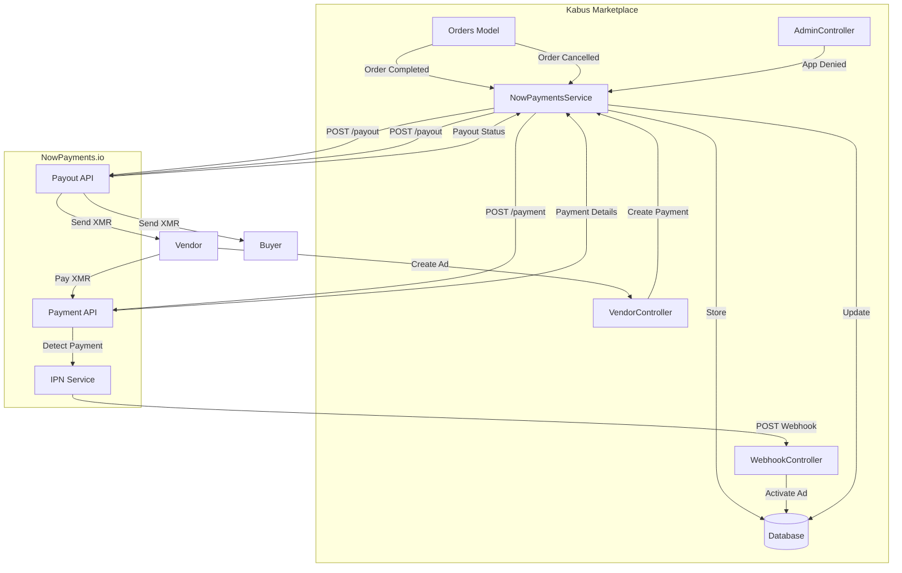
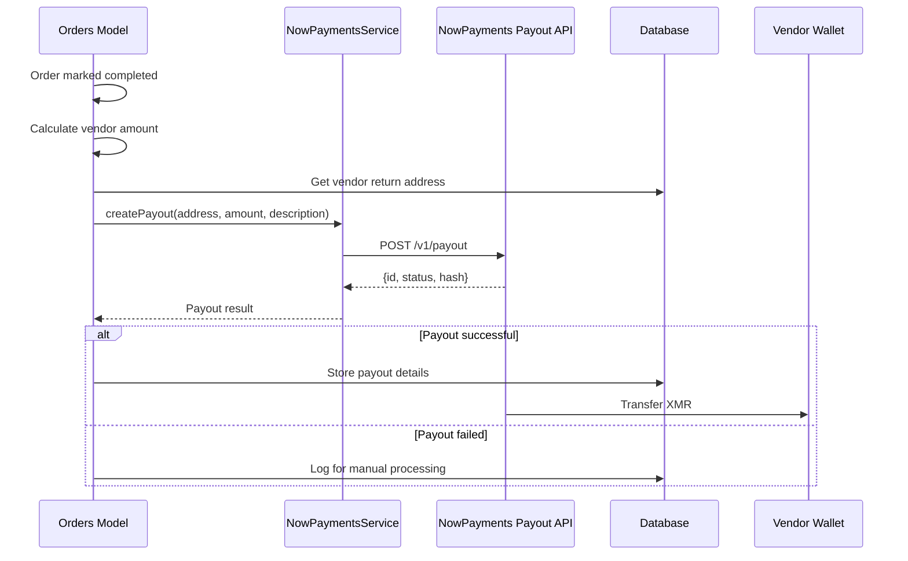
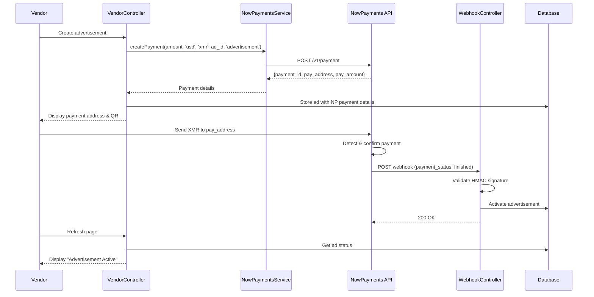

# Design Document: Complete NowPayments Migration

## Overview

This design document describes the architecture and implementation approach for completing the migration of all remaining Monero RPC functionality to NowPayments.io. This phase covers:

1. **Outgoing Payments (Payouts)**: Vendor payouts, buyer refunds, and admin refunds
2. **Advertisement Payments**: Incoming payments for product advertisements
3. **Cleanup**: Removal of deprecated Monero RPC code

The key architectural change for outgoing payments is using the NowPayments Payout API instead of direct Monero wallet RPC transfers.

## Architecture

### High-Level Architecture



### Payout Flow Sequence



### Advertisement Payment Flow



## Components and Interfaces

### 1. NowPaymentsService - Payout Method

**Location:** `app/Services/NowPaymentsService.php`

**New Method:**

```php
/**
 * Create a payout (withdrawal) to send cryptocurrency to an external address.
 *
 * @param string $address The recipient's cryptocurrency address
 * @param float $amount The amount to send in cryptocurrency
 * @param string $currency The cryptocurrency code (e.g., 'xmr')
 * @param string|null $description Optional description for the payout
 * @return array|null Payout details or null on failure
 */
public function createPayout(
    string $address,
    float $amount,
    string $currency = 'xmr',
    ?string $description = null
): ?array;
```

**API Request Format (NowPayments Payout API):**

```json
{
    "address": "46RGZ...",
    "amount": 0.5234,
    "currency": "xmr",
    "ipn_callback_url": "https://market.url/api/webhooks/nowpayments/payout"
}
```

**API Response Format:**

```json
{
    "id": "payout-uuid",
    "status": "PROCESSING",
    "amount": 0.5234,
    "currency": "xmr",
    "address": "46RGZ...",
    "hash": "tx-hash-if-available",
    "created_at": "2026-01-09T10:00:00.000Z"
}
```

**Note:** NowPayments Payout API requires a verified business account with sufficient balance. The API key must have payout permissions enabled.

### 2. Updated Orders Model

**Location:** `app/Models/Orders.php`

**Modified Methods:**

```php
/**
 * Process automatic payment to vendor when order is completed.
 * Uses NowPayments Payout API instead of Monero RPC.
 * 
 * @return bool
 */
public function processVendorPayment(): bool
{
    // Calculate vendor payment amount
    // Get vendor return address
    // Call NowPaymentsService::createPayout()
    // Update order with payout details
    // Log result
}

/**
 * Process automatic refund to buyer when an order is cancelled.
 * Uses NowPayments Payout API instead of Monero RPC.
 * 
 * @return bool
 */
public function processBuyerRefund(): bool
{
    // Calculate refund amount
    // Get buyer return address
    // Call NowPaymentsService::createPayout()
    // Update order with refund details
    // Log result
}
```

**Removed Methods:**
- `generatePaymentAddress()` - deprecated, replaced by NowPayments payment creation
- `checkPayments()` - deprecated, replaced by webhook handling

### 3. Updated AdminController

**Location:** `app/Http/Controllers/AdminController.php`

**Modified Method:**

```php
/**
 * Deny a vendor application and process refund via NowPayments.
 */
public function denyVendorApplication(VendorPayment $application)
{
    // Calculate refund amount
    // Get applicant return address
    // Call NowPaymentsService::createPayout()
    // Update application with refund details
    // Log result
}
```

### 4. Updated VendorController

**Location:** `app/Http/Controllers/VendorController.php`

**Modified Methods:**

```php
/**
 * Create a new advertisement with NowPayments payment.
 */
public function createAdvertisement(Request $request, Product $product)
{
    // Validate request
    // Calculate required amount
    // Call NowPaymentsService::createPayment() with case='advertisement'
    // Create advertisement with NP payment details
    // Redirect to payment page
}

/**
 * Show the advertisement payment page.
 * No longer polls for payment - relies on webhook.
 */
public function showAdvertisementPayment(string $identifier)
{
    // Get advertisement
    // Check expiration
    // Display payment details (no RPC polling)
}
```

**Removed:**
- `$walletRPC` property
- Constructor initialization of walletRPC

### 5. Updated WebhookController

**Location:** `app/Http/Controllers/WebhookController.php`

**New Methods:**

```php
/**
 * Check if the order_id corresponds to an advertisement payment.
 */
protected function isAdvertisementPayment(?string $orderId): bool;

/**
 * Process an advertisement payment webhook.
 */
protected function processAdvertisementPayment(string $orderId, array $payload): void;
```

**Updated `handle()` method** to include advertisement payment detection.

## Data Models

### Advertisements Table Changes

| Column | Type | Description |
|--------|------|-------------|
| np_payment_id | string, nullable, indexed | NowPayments payment identifier |
| pay_address | string, nullable | Cryptocurrency deposit address (replaces payment_address) |
| pay_amount | decimal(18,12), nullable | Exact crypto amount to pay |
| pay_currency | string, default 'xmr' | Payment cryptocurrency |
| ~~payment_address_index~~ | ~~integer~~ | Removed - no longer needed |

### Orders Table - Payout Columns

The existing columns will be used for payout tracking:
- `vendor_payment_amount` - Amount paid to vendor
- `vendor_payment_address` - Vendor's address
- `vendor_payment_at` - Timestamp of payout
- `buyer_refund_amount` - Amount refunded to buyer
- `buyer_refund_address` - Buyer's address
- `buyer_refund_at` - Timestamp of refund

**New columns for payout tracking:**

| Column | Type | Description |
|--------|------|-------------|
| vendor_payout_id | string, nullable | NowPayments payout ID for vendor payment |
| buyer_payout_id | string, nullable | NowPayments payout ID for buyer refund |

### VendorPayment Table - Refund Payout Column

| Column | Type | Description |
|--------|------|-------------|
| refund_payout_id | string, nullable | NowPayments payout ID for refund |

### Migration SQL Pseudocode

```sql
-- Advertisements table
ALTER TABLE advertisements ADD COLUMN np_payment_id VARCHAR(255) NULL;
ALTER TABLE advertisements ADD COLUMN pay_address VARCHAR(255) NULL;
ALTER TABLE advertisements ADD COLUMN pay_amount DECIMAL(18,12) NULL;
ALTER TABLE advertisements ADD COLUMN pay_currency VARCHAR(10) DEFAULT 'xmr';
ALTER TABLE advertisements DROP COLUMN payment_address_index;
CREATE INDEX idx_advertisements_np_payment_id ON advertisements(np_payment_id);

-- Orders table - payout tracking
ALTER TABLE orders ADD COLUMN vendor_payout_id VARCHAR(255) NULL;
ALTER TABLE orders ADD COLUMN buyer_payout_id VARCHAR(255) NULL;

-- Vendor payments table - refund payout tracking
ALTER TABLE vendor_payment_subaddresses ADD COLUMN refund_payout_id VARCHAR(255) NULL;
```

## Configuration Updates

**Location:** `config/nowpayments.php`

Add payout-specific configuration:

```php
return [
    // ... existing config ...
    
    /*
    |--------------------------------------------------------------------------
    | Payout Configuration
    |--------------------------------------------------------------------------
    */
    
    'payout_enabled' => env('NOWPAYMENTS_PAYOUT_ENABLED', true),
    
    // Separate callback URL for payout notifications (optional)
    'payout_callback_url' => env('NOWPAYMENTS_PAYOUT_CALLBACK_URL', '/api/webhooks/nowpayments/payout'),
];
```

## Correctness Properties

### Property 1: Payout Request Formation

*For any* valid payout request with recipient address, amount, and currency, the NowPaymentsService SHALL send a POST request to the `/payout` endpoint containing the `x-api-key` header and valid payout parameters.

**Validates: Requirement 1.1, 1.2, 1.5**

### Property 2: Successful Payout Response Handling

*For any* successful NowPayments payout API response containing `id` and `status`, the NowPaymentsService SHALL return an array containing these fields.

**Validates: Requirement 1.3**

### Property 3: Failed Payout Response Handling

*For any* failed NowPayments payout API response (HTTP error or API error), the NowPaymentsService SHALL log the error with full details and return null.

**Validates: Requirement 1.4**

### Property 4: Vendor Payout Calculation

*For any* completed order with `total_received_xmr > 0`, the vendor payment amount SHALL equal `total_received_xmr * (1 - commission_ratio)` where `commission_ratio = commission / subtotal`.

**Validates: Requirement 2.2**

### Property 5: Buyer Refund Calculation

*For any* cancelled order with `total_received_xmr > 0`, the buyer refund amount SHALL equal `total_received_xmr * (1 - cancellation_fee_percentage / 100)`.

**Validates: Requirement 3.2**

### Property 6: Payout Failure Non-Blocking

*For any* failed payout operation (vendor payment or buyer refund), the main operation (order completion or cancellation) SHALL NOT be blocked or rolled back.

**Validates: Requirement 10.2**

### Property 7: Advertisement Payment Creation

*For any* advertisement creation request, the VendorController SHALL call NowPaymentsService::createPayment() with case='advertisement' and store the returned `payment_id` and `pay_address` in the advertisement record.

**Validates: Requirement 5.1, 5.2**

### Property 8: Advertisement Webhook Processing

*For any* valid webhook with payment status "finished" or "confirmed" where the order_id matches an advertisement's payment_identifier, the WebhookController SHALL set `payment_completed = true` and set `starts_at` and `ends_at` dates.

**Validates: Requirement 6.2, 6.3**

### Property 9: No Monero RPC in Payment Flow

*For any* payment operation (vendor payout, buyer refund, admin refund, advertisement payment), the system SHALL NOT import or instantiate the MoneroIntegrations\MoneroPhp\walletRPC class.

**Validates: Requirement 2.6, 3.6, 4.5, 5.5, 8.3, 8.4**

### Property 10: Address Validation Independence

*For any* Monero address validation operation, the ReturnAddressController SHALL use only the Cryptonote library without requiring any RPC connection.

**Validates: Requirement 7.1, 7.2**

## Error Handling

### Payout API Errors

| Error Type | Handling Strategy |
|------------|-------------------|
| Network timeout | Log error, return null, continue main operation |
| HTTP 4xx errors | Log response body, return null, mark for manual processing |
| HTTP 5xx errors | Log response body, return null, suggest retry later |
| Insufficient balance | Log error, return null, alert admin |
| Invalid address | Log error, return null, mark for manual review |

### Payout Failure Recovery

When a payout fails:
1. Log full error details including order/application ID
2. Store the intended payout details (amount, address) in the database
3. Continue with the main operation (don't block order completion/cancellation)
4. Admin can query for orders/applications with failed payouts using:
   - Orders where `vendor_payment_at IS NOT NULL AND vendor_payout_id IS NULL`
   - Orders where `buyer_refund_at IS NOT NULL AND buyer_payout_id IS NULL`

### User-Facing Error Messages

- "Payment to vendor is being processed." - Payout initiated
- "Refund is being processed." - Refund payout initiated
- "Unable to process payment automatically. Our team will process it manually." - Payout failed
- "Unable to create advertisement payment. Please try again later." - Payment creation failed

## Testing Strategy

### Unit Tests

1. **NowPaymentsService Payout Tests**
   - Test `createPayout` with mocked HTTP client
   - Verify correct request format and headers
   - Test error handling for various failure scenarios

2. **Orders Model Payout Tests**
   - Test vendor payment calculation
   - Test buyer refund calculation
   - Test payout failure handling

3. **WebhookController Advertisement Tests**
   - Test advertisement payment identification
   - Test advertisement activation on webhook

### Property-Based Tests

1. **Payout Calculation Property Test**
   - Generate random order amounts and commission rates
   - Verify vendor payment calculation is correct
   - Minimum 100 iterations

2. **Refund Calculation Property Test**
   - Generate random received amounts and fee percentages
   - Verify buyer refund calculation is correct
   - Minimum 100 iterations

### Integration Tests

1. **End-to-End Vendor Payout Flow** (with mocked NowPayments API)
   - Complete order → Trigger payout → Verify database update

2. **End-to-End Buyer Refund Flow** (with mocked NowPayments API)
   - Cancel paid order → Trigger refund → Verify database update

3. **End-to-End Advertisement Flow** (with mocked NowPayments API)
   - Create ad → Generate payment → Receive webhook → Verify activation

## Security Considerations

1. **API Key Protection**: Payout API key must have limited permissions (payout only, no account management)
2. **Address Validation**: Always validate recipient addresses before initiating payouts
3. **Amount Limits**: Consider implementing daily/per-transaction payout limits
4. **Audit Trail**: Log all payout attempts with full details for audit purposes
5. **Webhook Verification**: Same HMAC signature validation as incoming payments
