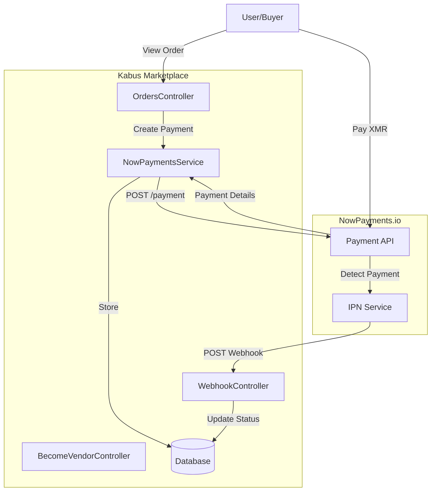
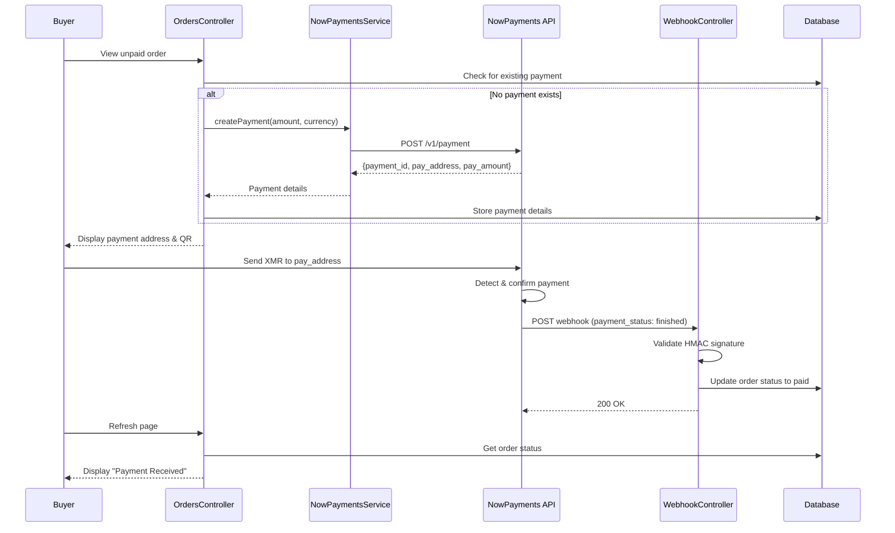

# Design Document: NowPayments.io Migration

## Overview

This design document describes the architecture and implementation approach for migrating the Kabus marketplace payment system from self-hosted Monero RPC to NowPayments.io hosted payment gateway. The migration eliminates the need for local wallet infrastructure while maintaining the same user experience for buyers and vendors.

The key architectural change is moving from a polling-based payment verification model (checking the local wallet RPC) to an event-driven model using webhooks (IPN callbacks from NowPayments).

## Architecture

### High-Level Architecture



### Payment Flow Sequence



## Components and Interfaces

### 1. NowPaymentsService

**Location:** `app/Services/NowPaymentsService.php`

**Purpose:** Encapsulates all communication with the NowPayments.io API.

**Interface:**

```php
class NowPaymentsService
{
    /**
     * Create a new payment request with NowPayments.
     *
     * @param float $priceAmount The amount in the price currency (e.g., USD)
     * @param string $priceCurrency The fiat currency code (e.g., 'usd')
     * @param string $payCurrency The cryptocurrency to accept (e.g., 'xmr')
     * @param string|null $orderId Internal order/reference ID
     * @param string|null $case Payment case type ('order' or 'vendor_fee')
     * @return array|null Payment details or null on failure
     */
    public function createPayment(
        float $priceAmount,
        string $priceCurrency,
        string $payCurrency,
        ?string $orderId = null,
        ?string $case = null
    ): ?array;
    
    /**
     * Get the status of an existing payment.
     *
     * @param string $paymentId The NowPayments payment ID
     * @return array|null Payment status or null on failure
     */
    public function getPaymentStatus(string $paymentId): ?array;
}
```

**API Request Format:**

```json
{
    "price_amount": 100.00,
    "price_currency": "usd",
    "pay_currency": "xmr",
    "ipn_callback_url": "https://market.url/api/webhooks/nowpayments",
    "order_id": "order-uuid-here",
    "order_description": "Order payment"
}
```

**API Response Format:**

```json
{
    "payment_id": "5745459419",
    "payment_status": "waiting",
    "pay_address": "46RGZ...",
    "price_amount": 100,
    "price_currency": "usd",
    "pay_amount": 0.5234,
    "pay_currency": "xmr",
    "order_id": "order-uuid-here",
    "order_description": "Order payment",
    "created_at": "2026-01-09T10:00:00.000Z"
}
```

### 2. WebhookController

**Location:** `app/Http/Controllers/WebhookController.php`

**Purpose:** Handles incoming IPN callbacks from NowPayments and updates payment statuses.

**Interface:**

```php
class WebhookController extends Controller
{
    /**
     * Handle incoming NowPayments webhook.
     *
     * @param Request $request
     * @return JsonResponse
     */
    public function handle(Request $request): JsonResponse;
}
```

**Webhook Payload Format (from NowPayments):**

```json
{
    "payment_id": 5745459419,
    "payment_status": "finished",
    "pay_address": "46RGZ...",
    "price_amount": 100,
    "price_currency": "usd",
    "pay_amount": 0.5234,
    "actually_paid": 0.5234,
    "pay_currency": "xmr",
    "order_id": "order-uuid-here",
    "order_description": "Order payment"
}
```

**Signature Validation Algorithm:**

1. Extract `x-nowpayments-sig` header
2. Sort webhook payload keys alphabetically (recursive for nested objects)
3. JSON encode the sorted payload with `JSON_UNESCAPED_SLASHES`
4. Calculate HMAC-SHA512 using IPN secret as key
5. Compare calculated signature with received signature

### 3. Configuration

**Location:** `config/nowpayments.php`

```php
return [
    'api_key' => env('NOWPAYMENTS_API_KEY'),
    'ipn_secret' => env('NOWPAYMENTS_IPN_SECRET'),
    'api_url' => env('NOWPAYMENTS_ENV') === 'sandbox'
        ? 'https://api-sandbox.nowpayments.io/v1/'
        : 'https://api.nowpayments.io/v1/',
    'default_pay_currency' => env('NOWPAYMENTS_DEFAULT_CURRENCY', 'xmr'),
];
```

### 4. Modified Controllers

**OrdersController Changes:**
- Remove `walletRPC` property and constructor initialization
- Remove `checkPayments()` calls
- Replace `generatePaymentAddress()` with NowPaymentsService call
- Inject `NowPaymentsService` via method injection

**BecomeVendorController Changes:**
- Remove `walletRPC` property and constructor initialization
- Remove `checkIncomingTransaction()` method
- Replace `createVendorPayment()` to use NowPaymentsService
- Inject `NowPaymentsService` via method injection

## Data Models

### Orders Table Changes

| Column | Type | Description |
|--------|------|-------------|
| np_payment_id | string, nullable, indexed | NowPayments payment identifier |
| pay_address | string, nullable | Cryptocurrency deposit address |
| pay_amount | decimal(18,12), nullable | Exact crypto amount to pay |
| pay_currency | string, default 'xmr' | Payment cryptocurrency |
| ~~payment_address_index~~ | ~~integer~~ | Removed - no longer needed |

**Note:** The existing `payment_address` column will be repurposed to store the NowPayments deposit address, or we can use the new `pay_address` column for clarity.

### Vendor Payment Subaddresses Table Changes

| Column | Type | Description |
|--------|------|-------------|
| np_payment_id | string, nullable, indexed | NowPayments payment identifier |
| pay_currency | string, default 'xmr' | Payment cryptocurrency |
| ~~address_index~~ | ~~integer~~ | Removed - no longer needed |

**Note:** The existing `address` column will store the NowPayments deposit address.

### Migration SQL Pseudocode

```sql
-- Orders table
ALTER TABLE orders ADD COLUMN np_payment_id VARCHAR(255) NULL;
ALTER TABLE orders ADD COLUMN pay_address VARCHAR(255) NULL;
ALTER TABLE orders ADD COLUMN pay_amount DECIMAL(18,12) NULL;
ALTER TABLE orders ADD COLUMN pay_currency VARCHAR(10) DEFAULT 'xmr';
ALTER TABLE orders DROP COLUMN payment_address_index;
CREATE INDEX idx_orders_np_payment_id ON orders(np_payment_id);

-- Vendor payment subaddresses table
ALTER TABLE vendor_payment_subaddresses ADD COLUMN np_payment_id VARCHAR(255) NULL;
ALTER TABLE vendor_payment_subaddresses ADD COLUMN pay_currency VARCHAR(10) DEFAULT 'xmr';
ALTER TABLE vendor_payment_subaddresses DROP COLUMN address_index;
CREATE INDEX idx_vendor_payments_np_payment_id ON vendor_payment_subaddresses(np_payment_id);
```


## Correctness Properties

*A property is a characteristic or behavior that should hold true across all valid executions of a system—essentially, a formal statement about what the system should do. Properties serve as the bridge between human-readable specifications and machine-verifiable correctness guarantees.*

### Property 1: Payment Request Formation

*For any* valid payment creation request with price amount, price currency, and pay currency, the NowPaymentsService SHALL send a POST request to the `/payment` endpoint containing the `x-api-key` header and an `ipn_callback_url` in the request body.

**Validates: Requirements 3.2, 3.5, 3.6**

### Property 2: Successful API Response Handling

*For any* successful NowPayments API response containing `payment_id`, `pay_address`, and `pay_amount`, the NowPaymentsService SHALL return an array containing these fields.

**Validates: Requirements 3.3**

### Property 3: Failed API Response Handling

*For any* failed NowPayments API response (HTTP error or API error), the NowPaymentsService SHALL return null.

**Validates: Requirements 3.4**

### Property 4: Webhook Signature Validation

*For any* webhook payload and IPN secret, the signature validation SHALL correctly verify that the HMAC-SHA512 of the sorted, JSON-encoded payload matches the `x-nowpayments-sig` header.

**Validates: Requirements 6.2**

### Property 5: Invalid Signature Rejection

*For any* webhook request with an invalid or missing signature, the WebhookController SHALL return a 403 HTTP response.

**Validates: Requirements 6.3**

### Property 6: Valid Webhook Processing

*For any* valid webhook with payment status "finished" or "confirmed", the WebhookController SHALL identify the payment type (order or vendor fee), update the corresponding database record to paid status, and return a 200 HTTP response with `{"status": "ok"}`.

**Validates: Requirements 6.4, 6.5, 6.8**

### Property 7: Order Status Update on Payment

*For any* order in "waiting_payment" status, when a valid webhook confirms payment, the order status SHALL be updated to "payment_received" and `is_paid` SHALL be set to true.

**Validates: Requirements 6.6**

### Property 8: Vendor Payment Completion

*For any* vendor payment record with `payment_completed` as false, when a valid webhook confirms payment, `payment_completed` SHALL be set to true.

**Validates: Requirements 6.7**

## Error Handling

### API Communication Errors

| Error Type | Handling Strategy |
|------------|-------------------|
| Network timeout | Log error, return null, display user-friendly message |
| HTTP 4xx errors | Log response body, return null, display error to user |
| HTTP 5xx errors | Log response body, return null, suggest retry later |
| Invalid JSON response | Log raw response, return null |

### Webhook Processing Errors

| Error Type | Handling Strategy |
|------------|-------------------|
| Missing signature header | Return 403, log warning |
| Invalid signature | Return 403, log warning with both signatures |
| Unknown order_id | Return 200 (acknowledge receipt), log warning |
| Database update failure | Return 500, log error |

### User-Facing Error Messages

- "Unable to create payment. Please try again later." - API communication failure
- "Payment service temporarily unavailable." - Service configuration error
- "Error processing payment. Please contact support." - Unexpected error

## Testing Strategy

### Unit Tests

Unit tests will verify individual component behavior in isolation:

1. **NowPaymentsService Tests**
   - Test `createPayment` with mocked HTTP client
   - Verify correct request format and headers
   - Test error handling for various failure scenarios

2. **WebhookController Tests**
   - Test signature validation with known good/bad signatures
   - Test payment type identification logic
   - Test database update operations

3. **Configuration Tests**
   - Verify config values load from environment
   - Test sandbox vs production URL selection

### Property-Based Tests

Property-based tests will use a PHP PBT library such as **PHPUnit with eris/eris** or **phpspec/prophecy** for generating test cases:

1. **Signature Validation Property Test**
   - Generate random payloads and secrets
   - Verify signature calculation is deterministic
   - Verify invalid signatures are always rejected
   - Minimum 100 iterations

2. **API Request Formation Property Test**
   - Generate random valid payment parameters
   - Verify all required fields are present in request
   - Minimum 100 iterations

3. **Webhook Processing Property Test**
   - Generate random valid webhook payloads
   - Verify correct status updates occur
   - Minimum 100 iterations

### Integration Tests

1. **End-to-End Payment Flow** (with mocked NowPayments API)
   - Create order → Generate payment → Receive webhook → Verify status update

2. **Vendor Fee Payment Flow** (with mocked NowPayments API)
   - Initiate vendor payment → Receive webhook → Verify completion

### Test Configuration

```php
// phpunit.xml additions
<testsuites>
    <testsuite name="NowPayments">
        <directory>tests/Feature/NowPayments</directory>
        <directory>tests/Unit/NowPayments</directory>
    </testsuite>
</testsuites>
```

### Property Test Tagging

Each property test must be tagged with the design property it validates:

```php
/**
 * @test
 * Feature: nowpayments-migration, Property 4: Webhook Signature Validation
 * Validates: Requirements 6.2
 */
public function signature_validation_is_correct_for_all_payloads()
{
    // Property-based test implementation
}
```
